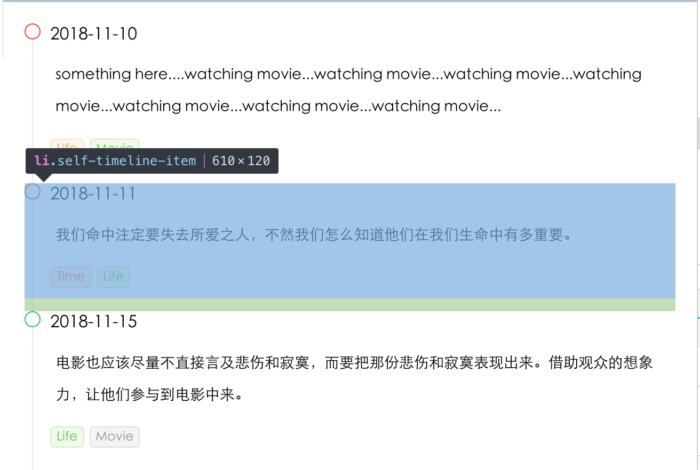

# Timeline组件

<!-- 预览图 -->
<!--  -->

:beers: :beers: :beers: :beers: :beers:
:tada: :tada: :tada: :tada: :tada:
<Milestone/>
:beers: :beers: :beers: :beers: :beers:
:tada: :tada: :tada: :tada: :tada:

## 功能实现

主要参考了 `iview-ui`。
实现的Timeline组件包含部分:

- 头部-head（小圆圈）
- 尾部-tail（竖着那条线）
- 内容-content
- 控制最后一个节点tail的显示与否

两个组件: `Timeline.vue` + `TimelineItem.vue`。其中`TimelineItem.vue`通过`Timeline.vue`的`slot`传进来。

```html
/* Timeline.vue */
<template>
  <ul :class="forTimeline">
    <slot></slot>
  </ul>
</template>

<script>
  const prefixCls = "self-timeline"

  export default {
    name: "Timeline",
    props: {
      pending: {
        type: Boolean,
        default: false
      }
    },
    computed: {
      // 一开始，为加上timeline类
      // 是否设置pending类
      forTimeline () {
        return [
          prefixCls,
          {
            [`${prefixCls}-pending`]: this.pending
          }
        ]
      }
    }
  }
</script>
```

```html
/* TimelineItem.vue */
<template>
  <li :class="itemClass">
    <div :class="tailClass"></div>

    <div :class="headClass" :style="customColor" ref="dot">
      <slot name="dot"></slot>
    </div>

    <div :class="contentClass">
      <slot></slot>
    </div>
  </li>
</template>

<script>
const prefixCls = 'self-timeline';

export default {
  name: 'TimelineItem',
  props: {
    color: {
      type: String,
      default: 'blue'
    }
  },
  data () {
    return {
      dot: false
    }
  },
  mounted () {
    // 是否使用自定义的图标
    // 如果包含了传入的内容，说明是有意图使用自定义的内容
    // 同时默认的图标不需要显示
    this.dot = this.$refs.dot.innerHTML.length ? true : false
  },
  computed: {
    itemClass () {
      return `${prefixCls}-item`;
    },
    tailClass () {
      return `${prefixCls}-item-tail`
    },
    headClass () {
      // 注意: item-head-custom定义时，因为如果要使用变量做key，需要加个中括号
      // 这个与vue没关系

      // 而返回一个数组, 里面包含对象样式，最终全都解析成html的class
      // 这个是vue的用法
      return [
        `${prefixCls}-item-head`,
        {
          [`${prefixCls}-item-head-custom`]: this.dot,
          [`${prefixCls}-item-head-${this.color}`]: !this.dot // 暂时不使用this.headColorShow, 样式有点问题
        }
      ]
    },
    headColorShow () {
      return this.color == 'blue' || this.color == 'green' || this.color == 'red'
    },
    customColor () {
      let style = {}
      if (this.color) {
        if (!this.headColorShow) {
          style = {
            'color': this.color,
            'border-color': this.color
          }
        }
      }

      return style;
    },
    contentClass () {
      return `${prefixCls}-item-content`
    }
  }
}
</script>
```

```scss
<style lang="scss">
  $timeline-prefix-cls: self-timeline;
  $timeline-color: #e8eaec;
  $primary-color: #2d8cf0;
  $error-color:  #ed4014;
  $success-color: #19be6b;

  .#{$timeline-prefix-cls} {
    list-style: none;
    margin: 0;
    padding: 0;

    &-item {
      margin: 0 !important;
      padding: 0 0 12px 0;
      list-style: none;
      position: relative;

      &-tail {
        height: 100%;
        border-left: 1px solid $timeline-color;
        position: absolute;
        left: 7px;
        top: 0;
      }

      &-head {
        width: 13px;
        height: 13px;
        background-color: #fff;
        border-radius: 50%;
        border: 1px solid transparent;
        position: absolute;

        &-blue {
          border-color: $primary-color;
          color: $primary-color;
        }

        &-red {
          border-color: $error-color;
          color: $error-color;
        }

        &-green {
          border-color: $success-color;
          color: $success-color;
        }
      }

      &-content {
        padding: 1px 1px 10px 24px;
      }

      // 注意拼接类名时，使用#{$var_name}
      // 最后一条竖线去掉
      &:last-child {
        .#{$timeline-prefix-cls}-item-tail {
          display: none;
        }
      }
    }

    // 如果指定了pending，则对倒数第二个item做一些处理
    &-pending &-item:nth-last-of-type(2) {
      // tail线变成......
      .#{$timeline-prefix-cls}-item-tail {
        border-left: 1px dotted $timeline-color;
      }

      // 让内容项保证一定的高度，保持美观
      .#{$timeline-prefix-cls}-item-content {
        min-height: 48px;
      }
    }
  }
</style>

```

## 配合[SASS](https://www.sasscss.com/)

::: tip

- 使用 `&` 来引用父级元素

:::

```sass
.self-timeline {
    list-style: none;

    &-item {
      margin: 0 !important;
    }
}

// 生成的类如下:
// .self-timeline
// .self-timeline-item
```

::: tip

- 使用 `$` 来定义变量
- 使用 `#` 来拼接字符串（跟Ruby一样）

:::

```sass
$timeline-prefix-cls: self-timeline;
.#{$timeline-prefix-cls} {
  list-style: none;
}
```

## 总结

:tada: :100: :100: :100:

- 当从头跟着实现时，会遇到一些小问题，这个时候查文档才更加深刻
- vue props 可以使用 `v-bind` 来实现动态绑定
- js 通过 `[]` 来使用动态的key
- 对于 `head + tail` 通过改变定位来实现